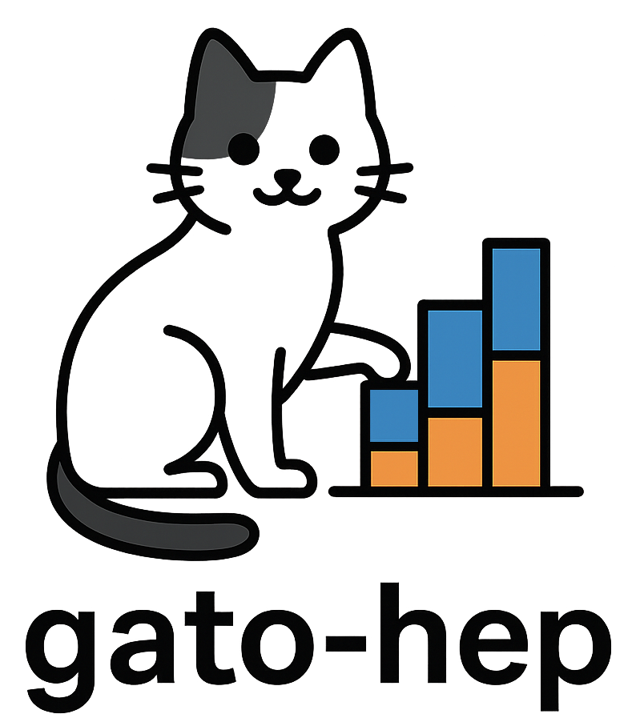

<p align="left">
  <picture>
    <source media="(prefers-color-scheme: dark)" srcset="docs/source/logos/gato-hep-darkmode.png">
    <source media="(prefers-color-scheme: light)" srcset="docs/source/logos/gato-hep.png">
    
  </picture>
</p>

[](https://gato-hep.readthedocs.io/en/latest/)

We present `gato-hep`: the Gradient-based cATegorization Optimizer for High Energy Physics analyses.
`gato-hep` learns boundaries in N-dimensional discriminants that maximize signal significance for binned likelihood fits, using a differentiable approximation of signal significance and gradient descent techniques for optimization with TensorFlow.

- 📘 Documentation: https://gato-hep.readthedocs.io/
- 📦 PyPI: https://pypi.org/project/gato-hep/
- 🧪 Examples: see the `examples/` directory in this repository

Key Features
------------
- Optimize categorizations in multi-dimensional spaces using Gaussian Mixture Models (GMM) or 1D sigmoid-based models
- Set the range of the discriminant dimensions as needed for your analysis
- Penalize low-yield or high-uncertainty categories to keep optimizations analysis-friendly
- Built-in annealing schedules for temperature / steepness (setting the level of approximation for differentiability), and learning rate to stabilize training
- Ready-to-run toy workflows that mirror real HEP analysis patterns

Installation
------------

### Latest release (PyPI)

```bash
pip install gato-hep
```

The base install targets CPU execution and pulls the tested TensorFlow stack automatically. Optional extras:

```bash
pip install "gato-hep[gpu]"   # CUDA-enabled TensorFlow wheels
```

For the GPU extra you still need NVIDIA drivers and CUDA libraries that match the selected TensorFlow build.

### From source

```bash
git clone https://github.com/FloMau/gato-hep.git
cd gato-hep
python -m venv .venv  # or use micromamba/conda
source .venv/bin/activate
pip install -e ".[dev]"
```

Requirements: Python ≥ 3.10. See `pyproject.toml` for the authoritative dependency pins.

Quickstart
----------
The snippet below mirrors the three-class softmax demo.
It generates the 3D toy sample, fits a two-dimensional Gaussian mixture model to the softmax scores, and reports the per-signal significances produced by the learnt categories.

```python
import numpy as np
import tensorflow as tf
from pathlib import Path

from gatohep.data_generation import generate_toy_data_3class_3D
from gatohep.models import gato_gmm_model
from gatohep.utils import asymptotic_significance

# setup class for the 2D discriminant optimization
class SoftmaxGMM(gato_gmm_model):
    def __init__(self, n_cats, temperature=0.3):
        super().__init__(
            n_cats=n_cats,
            dim=2,
            temperature=temperature,
            mean_norm="softmax",
        )
    # how to calculate significance
    def call(self, data_dict):
        probs = self.get_probs(data_dict)
        sig1 = tf.zeros(self.n_cats, tf.float32)
        sig2 = tf.zeros(self.n_cats, tf.float32)
        bkg = tf.zeros(self.n_cats, tf.float32)

        for proc, gamma in probs.items():
            weights = data_dict[proc]["weight"]
            yields = tf.reduce_sum(gamma * weights[:, None], axis=0)
            if proc == "signal1":
                sig1 += yields
            elif proc == "signal2":
                sig2 += yields
            else:
                bkg += yields

        # we use these differentiable yields to calculate the significances for both signals
        z1 = tf.sqrt(tf.reduce_sum(asymptotic_significance(sig1, bkg + sig2) ** 2))
        z2 = tf.sqrt(tf.reduce_sum(asymptotic_significance(sig2, bkg + sig1) ** 2))
        # return negative geometric mean as loss
        return -tf.sqrt(z1 * z2)

# load your data as dictionary containing pandas DataFrames, or use the integrated toy data generation:
data = generate_toy_data_3class_3D(seed=seed, n_bkg=500_000)
tensors = convert_data_to_tensors(data)

# example: use 10 bins
model = SoftmaxGMM(n_cats=10, temperature=0.3)
optimizer = tf.keras.optimizers.RMSprop(learning_rate=0.05)

# actual training
for epoch in range(100):
    with tf.GradientTape() as tape:
        loss = model.call(tensors)
    grads = tape.gradient(loss, model.trainable_variables)
    optimizer.apply_gradients(zip(grads, model.trainable_variables))

# Save the trained model for later use in the analysis to some path
model.save(checkpoint_path)

# Restore the model
restored = SoftmaxGMM(n_cats=10, temperature=0.3)
restored.restore(checkpoint_path)

# Obtain the hard (non-differentiable) bin assignments
assignments = restored.get_bin_indices(tensors)
```

See `examples/three_class_softmax_example/run_example.py` for the full training loop with schedulers, plotting helpers, and GIF generation.

Examples & Tutorials
--------------------
- `examples/1D_example/run_sigmoid_example.py` – sigmoid-based boundaries for a single discriminant.
- `examples/1D_example/run_gmm_example.py` – GMM-based categorisation for the same data.
- `examples/three_class_softmax_example/run_example.py` – optimize categories directly on a 3-class softmax output (shown in 2D projections).
- `examples/bumphunt_example/run_example.py` – $H\to\gamma\gamma$–style bump hunt example with inference on the mass, but including the background over a wider range for increased statistical power.

Every script populates an `examples/.../Plots*/` folder with plots and checkpoints.

Further Reading
---------------
- Full documentation, including the API reference: https://gato-hep.readthedocs.io/
- Issues & feature requests: https://github.com/FloMau/gato-hep/issues

Contributing
------------
1. Fork and branch: `git checkout -b feature/xyz`.
2. Implement changes under `src/gatohep/` and possibly add/adjust tests in `tests/`.
3. Format and lint (`flake8`) and run `pytest`.
4. Open a pull request summarizing the physics motivation and technical changes.

License
-------
MIT License © Florian Mausolf
